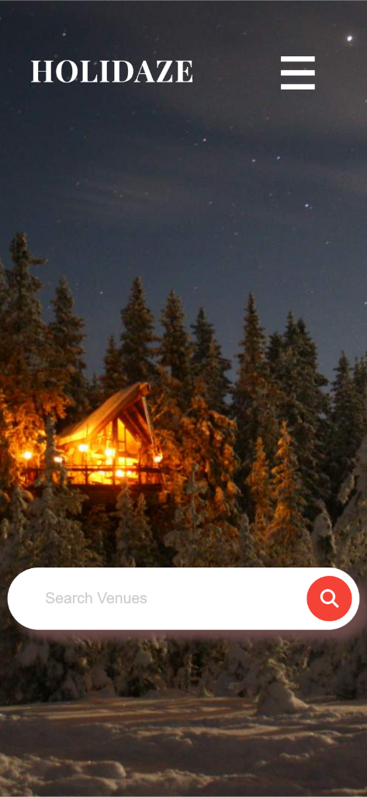

# Holidaze (Booking Website)

## Overview
Holidaze is a React-based booking website designed to provide a seamless experience for booking your next stay, similar to Airbnb and Booking.com. The application features various functionalities including browsing listings, managing bookings, and a streamlined booking process.

### Key Features
- **Listing Browsing:** Users can browse through a list of properties fetched from an API.
- **Property Details:** Detailed view of each property including images, descriptions, and reviews.
- **Booking Management:** Users can book properties, view their bookings, and cancel if needed.
- **Booking Process:** A streamlined booking process with a confirmation page upon completion.
- **Contact Form:** A contact page with a form for users to reach out with inquiries.
- **Search Functionality:** Users can search for properties using a search bar in the navigation.

### Code Stack
- **React:** For building the user interface.
- **React Router:** For client-side routing.
- **Context API:** For state management of bookings.
- **FontAwesome:** For icons.
- **CSS:** For styling components and pages.

## Project Structure
- **Components:** Reusable components such as Navbar, Footer, Property, and Booking.
- **Pages:** Different pages of the application including HomePage, PropertyPage, BookingPage, BookingConfirmationPage, and ContactPage.
- **Styles:** CSS files for styling the components and pages.
- **Assets:** Images and other static assets used in the project.

### Getting Started
1. **Clone** the repository to your local machine.
2. **Install Dependencies:** Run `npm install` to install all necessary dependencies.
3. **Start the Application:** Run `npm start` to start the development server and open the application in your browser.
4. **Explore:** Navigate through the application to explore its features.

### Contact
For any inquiries or feedback, please contact mariuskvaal1@gmail.com.

### Contribution
Feel free to fork the project and submit pull requests for improvements or new features.
